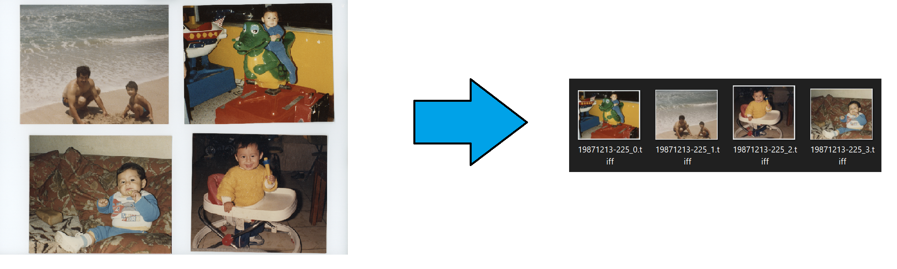

# Photography Tools
A small collection of functions for various photography tasks. The main one is the `split_multi_scanned_photos` that I needed to crop whole flatbed scans on my Epson V600, their software is crappy and took too long to select and scan each photo so I would scan a grid of 4 photos and split them using this function. Any PR are welcome as well and requests for new functions. 



<hr>

### Dependencies
 
* matplotlib 
* tifffile
* scikit-image 
* tqdm
 <hr>

### Install

This is not yet on pypi so you need to install it manually. 

1) Clone the repository to your local hard drive
2) open up anaconda prompt and change directory to 
3) ```pip install -e .```
4) Start using the library scripts!

<hr>

### Usage
I've included a main script that I use for my processing as an example. The small script grabs all tiffs found in a specified folder and tries to split them. I scanned about 40GB of photos so far and it has worked fairly well on ~95% of the scans, it runs into problems if the image has large areas of white that may be confused for background, at that point run the function in debug mode and only on that image to see why it may be failing.  

#### Main functions

1)  `split_multi_scanned_photos`

_Note: Function will take the filename of the original scanned image and append the image index to the new filename._
  * **path_im** : path to image on hdd.
  * **path_output** : path to where you want images to be save to, otherwise an output directory will be created at the root of the files. The default is None.
  * **region_threshold** :regions of interest smaller than these size will be ignored . The default is 1e6.
  * **pad** : pads the bounding box to prevent accidental cropping of photos edge. The default is 50px.
  * **deskew** : Deskew photo on the fly. The default is True.
  * **debug** : Show intermedaite images for debugging. The default is False.
  
2)  `thumbnail generator`
 * This function will scale all the photos in a folder by a specified amount. I used this to batch downsaple a lot of photos.
 

